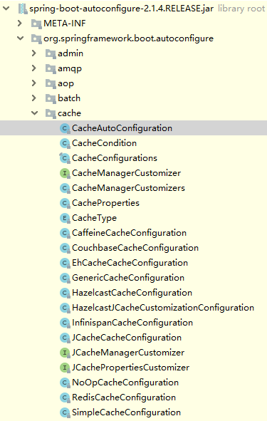

[TOC]


# 前言


# 一、Spring缓存支持


Spring 框架提供一种抽象的缓存机制，定义了 `org.springframework.cache.CacheManager` 和 `org.springframework.cache.Cache` 接口用来统一不同的缓存的技术

> - `CacheManager`是 Spring 提供的各种缓存技术抽象接口
> - `Cache`接口包含缓存的各种操作（增加、删除、获得缓存，我们一般不会直接和此接口打交道）


## 1.Spring支持的CacheManager

针对不同的缓存技术，需要实现不同的 `CacheManager`，Spring5.x 定义了如下的 `CacheManager`实现

| CacheManager              | 描述                                                         |
| ------------------------- | ------------------------------------------------------------ |
| SimpleCacheManager        | 使用简单的 Collection 来存储缓存，主要用来测试用途           |
| ConcurrentMapCacheManager | 使用 ConcurrentMap 来存储缓存，是默认的 CacheManager         |
| EhCacheCacheManager       | 使用 EhCache 作为缓存技术                                    |
| CaffeineCacheManager      | 使用`caffeine`作为缓存技术（Guava Cache被替换）              |
| HazelcastCacheManager     | 使用 Hazelcast 作为缓存技术                                  |
| JCacheCacheManager        | 支持 `JCache` (JSR-107) 标准的实现作为缓存技术，如 `Apache Commons JCS` |
| RedisCacheManager         | 使用 Redis 作为缓存技术                                      |


若想使用对应的缓存技术，则需注册对应的`CacheManager`的实现 Bean（除了其他额外配置），以 `EhCache`缓存技术为例：

```java
@Bean 
public EhCacheCacheManager cacheManager(CacheManager ehCacheCacheManager) { 
    return new EhCacheCacheManager(ehCacheCacheManager); 
} 
```


## 2.声明式缓存注解

> 参见：[Spring5官方文档——32.3 基于声明式注解的缓存](https://lfvepclr.gitbooks.io/spring-framework-5-doc-cn/content/32/32-3.html)

Spring 提供了如下注解，来声明缓存规则（注解式AOP的应用）:


### 2.1 @Cacheable 

在目标方法执行前，Spring 先查看缓存中是否有数据

- 若有数据，则直接返回缓存数据

- 若没有数据，则执行目标方法并将方法返回值放入缓存


属性详解：

> - `key`：缓存的 key，可以为空，如果指定要按照 SpEL 表达式编写，如果不指定，则缺省按照方法的所有参数进行组合（如：`@Cacheable(value="user",key="#userName")`）
> - `value`：缓存的名称，必须指定至少一个（如：`@Cacheable(value="user")` 或者 `@Cacheable(value={"user1","use2"})`）
> - `condition`：缓存的条件，可以为空，使用 SpEL 编写，返回 true 或者 false，只有为 true 才进行缓存（如：`@Cacheable(value = "user", key = "#id",condition = "#id < 10")`）


### 2.2 @CachePut

将方法返回值放入缓存


属性与`@Cacheable `保持一致


### 2.3 @CacheEvit

根据条件清除缓存


属性详解：

> - `key`、`value`、`condition`同上
> - `allEntries`：是否清空所有缓存内容，缺省为 false，如果指定为 true，则方法调用后将立即清空所有缓存（如：`@CacheEvict(value = "user", key = "#id", allEntries = true)`）
> - `beforeInvocation`： 是否在方法执行前就清空，缺省为 false，如果指定为 true，则在方法还没有执行的时候就清空缓存，缺省情况下，如果方法执行抛出异常，则不会清空缓存（如：`@CacheEvict(value = "user", key = "#id", beforeInvocation = true)`）


```java
@CacheEvict(cacheNames="books", allEntries=true)
public void loadBooks(InputStream batch)
```


### 2.4 @Caching

可以通过 @Caching 注解组合多个注解策略在一个方法上

```java
@Caching(evict = {
    @CacheEvict("primary"), 
    @CacheEvict(cacheNames="secondary", key="#p0")
})
public Book importBooks(String deposit, Date date)
```


### 2.5 @CacheConfig

该注解修饰类级别。

可以使用*@*CacheConfig配置方法级别上的缓存操作共享的公共属性，比如缓存操作的缓存名称、CacheManager、keyGenerator、cacheResolver，这样类中方法上的其他缓存操作注解就不用再反复配置相同的值。如：

```java
@CacheConfig("books")
public class BookRepositoryImpl implements BookRepository {

    @Cacheable  // 共享缓存名称
    public Book findBook(ISBN isbn) {...}
}
```


操作级别上的自定义会覆盖 `@CacheConfig` 的自定义。因此，每个缓存操作都会有三个级别的定义：

- 全局配置，可用于 `CacheManager` 和 `KeyGenerator`
- 类级别，用 `@CacheConfig`
- 操作级别层面


### 2.6 @EnableCaching

Spring 默认没有开启声明式缓存支持，可以在配置类上使用该注解进行开启，如

```java
@Configuration
@EnableCaching
public class AppConfig {
}
```


# 二、Spring Boot的支持

## 1. CacheManager 自动配置

在Spring中使用缓存技术的关键是配置CacheManager，而Spring Boot为我们自动配置了多个CacheManager的实现。


Spring Boot 的 CacheManager 的自动配置放置在 `org.springframework.boot.autoconfigure.cache` 包中，如下图：




在不做任何额外配置的情况下，默认使用的是SimpleCacheConfiguration，即使用ConcurrentMapCacheManager

```java
/*
 * Copyright 2012-2017 the original author or authors.
 *
 * Licensed under the Apache License, Version 2.0 (the "License");
 * you may not use this file except in compliance with the License.
 * You may obtain a copy of the License at
 *
 *      https://www.apache.org/licenses/LICENSE-2.0
 *
 * Unless required by applicable law or agreed to in writing, software
 * distributed under the License is distributed on an "AS IS" BASIS,
 * WITHOUT WARRANTIES OR CONDITIONS OF ANY KIND, either express or implied.
 * See the License for the specific language governing permissions and
 * limitations under the License.
 */

package org.springframework.boot.autoconfigure.cache;

import java.util.List;

import org.springframework.boot.autoconfigure.condition.ConditionalOnMissingBean;
import org.springframework.cache.CacheManager;
import org.springframework.cache.concurrent.ConcurrentMapCacheManager;
import org.springframework.context.annotation.Bean;
import org.springframework.context.annotation.Conditional;
import org.springframework.context.annotation.Configuration;

/**
 * Simplest cache configuration, usually used as a fallback.
 *
 * @author Stephane Nicoll
 * @since 1.3.0
 */
@Configuration
@ConditionalOnMissingBean(CacheManager.class)
@Conditional(CacheCondition.class)
class SimpleCacheConfiguration {

	private final CacheProperties cacheProperties;

	private final CacheManagerCustomizers customizerInvoker;

	SimpleCacheConfiguration(CacheProperties cacheProperties,
			CacheManagerCustomizers customizerInvoker) {
		this.cacheProperties = cacheProperties;
		this.customizerInvoker = customizerInvoker;
	}

	@Bean
	public ConcurrentMapCacheManager cacheManager() {
		ConcurrentMapCacheManager cacheManager = new ConcurrentMapCacheManager();
		List<String> cacheNames = this.cacheProperties.getCacheNames();
		if (!cacheNames.isEmpty()) {
			cacheManager.setCacheNames(cacheNames);
		}
		return this.customizerInvoker.customize(cacheManager);
	}

}

```


## 2.默认配置

Spring Boot支持以 `spring.cache`为前缀的属性来配置缓存

```
spring.cache.type=  # 可选generic,ehcache,hazelcast,infinispan,jcache,redis, guava,simple,none
spring.cache.cache-names= # 程序启动时创建缓存名称
spring.cache.ehcache.config= #  ehcache配置文件地址
spring.cache.hazelcast.config= #  hazelcast 配置文件地址
spring.cache.infinispan.config= #  infinispan 配置文件地址
spring.cache.jcache.config= #  jcache 配置文件地址
spring.cache.jcache.provider= #当多个 jcache实现在类路径中的时候，指定jcache实现
spring.cache.guava.spec= # guava specs 
```


在Spring Boot环境下，使用缓存技术只需在项目中导入相关缓存技术的依赖包，并在配置类使用@EnableCaching开启缓存支持即可


# 三、入门实例

下面将以Spring Boot默认的ConcurrentMapCacheManager作为缓存技术，来演示 Spring 声明式缓存的用法

## 1.数据库准备

创建数据库`spring-boot-sample` ，然后创建表`user`

```sql
DROP TABLE IF EXISTS `user`;
CREATE TABLE `user`  (
  `id` int(11) NOT NULL AUTO_INCREMENT  COMMENT '主键自增',
  `username` varchar(50) NOT NULL COMMENT '用户名',
  `password` varchar(64) NOT NULL COMMENT '密码',
  `email`    varchar(50) NOT NULL COMMENT '邮箱',
  `age` int (3) unsigned DEFAULT 3 COMMENT '年龄',
  `create_time` timestamp NOT NULL DEFAULT CURRENT_TIMESTAMP COMMENT '创建时间',
  `update_time` timestamp NOT NULL DEFAULT CURRENT_TIMESTAMP ON UPDATE CURRENT_TIMESTAMP COMMENT '更新时间',
  PRIMARY KEY (`id`)
) ENGINE=InnoDB DEFAULT CHARSET=utf8 COMMENT='用户表';
```


## 2.引入依赖

```xml
    <dependencies>
        <dependency>
            <groupId>org.springframework.boot</groupId>
            <artifactId>spring-boot-starter-web</artifactId>
        </dependency>
        <dependency>
            <groupId>org.springframework.boot</groupId>
            <artifactId>spring-boot-starter-data-jpa</artifactId>
        </dependency>
        <dependency>
            <groupId>mysql</groupId>
            <artifactId>mysql-connector-java</artifactId>
        </dependency>

        <!-- spring-boot-starter-cache -->
        <dependency>
            <groupId>org.springframework.boot</groupId>
            <artifactId>spring-boot-starter-cache</artifactId>
        </dependency>
    </dependencies>
```


## 3.配置

### 3.1 `application.yml`

配置数据源和JPA

```yml
server:
  port: 8088
  servlet:
    context-path: /

spring:
  datasource:       # 配置数据源
    driver-class-name: com.mysql.cj.jdbc.Driver
    url: jdbc:mysql://localhost:3306/spring-boot-sample?useUnicode=true&characterEncoding=utf8&serverTimezone=GMT%2B8
    username: root
    password: root
  jpa:                 # 配置jpa
    database: mysql       # 数据库类型
    show-sql: true        # 打印sql语句
    hibernate:
      ddl-auto: update    # 加载 Hibernate时， 自动更新数据库结构

```


### 3.2 CacheConfiguration

开启 Spring 声明式缓存支持

```java
@Configuration
@EnableCaching
public class CacheConfiguration {

}
```


## 4.业务实现

### 4.1 entity

- BaseEntity

  ```java
  @Data
  @MappedSuperclass  // 声明子类可继承基类字段
  @EntityListeners(AuditingEntityListener.class)   // 监听实体类变更
  public class BaseEntity {
  
  	@Id
  	@GeneratedValue(strategy = GenerationType.IDENTITY)
  	private Long id;
  
  	@CreatedDate  // 自动填充 CreatedDate
  	private LocalDateTime createTime;
  
  	@LastModifiedDate // 自动填充 LastModifiedDate
  	private LocalDateTime updateTime;
  }
  ```
  
  
  
- User

  ```java
  @Data
  @NoArgsConstructor
  @AllArgsConstructor
  @Entity
  @Table(name = "user")
  @DynamicInsert
  public class User extends BaseEntity{
  
      private String username;
  
      private String password;
  
      private String email;
  
      private Integer age;
  
  }
  
  ```
  
  


### 4.2 UserRepository

```java
@Repository
public interface UserRepository extends JpaRepository<User, Long> {

    /**
     * 查询年龄大于等于指定年龄的用户
     * @param age 年龄
     * @return userList
     */
    List<User> findByAgeGreaterThanEqualOrderById(Integer age);

    /**
     * 根据用户名查询用户信息
     *
     * @param username 用户名
     * @return userList
     */
    User findByUsername(String username);


    /**
     * 根据用户名模糊查询
     * @param username username
     * @return userList
     */
    List<User> findByUsernameLike(String username);

    /**
     * 模糊查询
     * @param username
     * @return
     */
    List<User> findByUsernameContaining(String username);
}

```


### 4.3.service

- UserService

  ```java
  public interface UserService {
  
  	User save(User user);
  
  	void remove(Long id);
  
  	User findByUsername(User user);
  
  }
  ```
  
  


- UserServiceImpl

  ```java
  @Slf4j
  @Service
  public class UserServiceImpl implements UserService {
  
  	UserRepository userRepository;
  
  	public UserServiceImpl(UserRepository userRepository) {
  		this.userRepository = userRepository;
  	}
  
  	@Override
  	@CachePut(value = "user", key = "#user.username")
  	public User save(User user) {
  		User u = userRepository.save(user);
  		log.info("新增：缓存用户，用户id为:{}", u.getId());
  		return u;
  	}
  
  
  	@Override
  	@CacheEvict(value = "user")
  	public void remove(Long id) {
  		log.info("删除：删除缓存，用户id为:{}",id);
  		userRepository.deleteById(id);
  	}
  
  	@Override
  	@Cacheable(value = "user", key = "#user.username")
  	public User findByUsername(User user) {
  		user = userRepository.findByUsername(user.getUsername());
  		log.info("查询：缓存用户，用户id为:{}",user.getId());
  		return user;
  	}
  
  }
  ```
  
  


## 5.单元测试

- UserServiceTest

```java
@RunWith(SpringRunner.class)
@SpringBootTest
@Transactional
@Rollback
@Slf4j
class UserServiceTest {

    @Autowired
    UserService userService;


    @Test
    public void testCache() {
        User user0 = new User("aatomcat000","password", "aatomcat000@qq.com", 20);
        List<User> userToAddList = new ArrayList<>();
        userToAddList.add(user0);
        userToAddList.add(new User("tomcat","password", "tomcat@qq.com",21));
        userToAddList.add(new User("tttomcat","password", "tttomcat@qq.com",22));
        userToAddList.add(new User("tttomcat111","password", "tttomcat111@qq.com",23));
        userToAddList.add(new User("tomcataaa","password", "tomcataaa@qq.com",24));

        // 新增用户
        userToAddList.forEach(user -> {
            userService.save(user);
        });
        log.info("==========新增用户完毕============");

        User user1 = userService.findByUsername(user0);
        User user2 = userService.findByUsername(user0);
        User user3 = userService.findByUsername(user0);

        userService.remove(user0.getId());
    }
}
```


运行测试类，发现会输出如下日志，而`userService.findByUsername(user0)` 的日志却没有输出，说明走了缓存

```
2020-03-19 23:48:44.982  INFO 18508 --- [           main] c.r.s.s.c.service.impl.UserServiceImpl   : 新增：缓存用户，用户id为:7
Hibernate: insert into user (age, email, password, username) values (?, ?, ?, ?)
2020-03-19 23:48:45.055  INFO 18508 --- [           main] c.r.s.s.c.service.impl.UserServiceImpl   : 新增：缓存用户，用户id为:8
Hibernate: insert into user (age, email, password, username) values (?, ?, ?, ?)
2020-03-19 23:48:45.058  INFO 18508 --- [           main] c.r.s.s.c.service.impl.UserServiceImpl   : 新增：缓存用户，用户id为:9
Hibernate: insert into user (age, email, password, username) values (?, ?, ?, ?)
2020-03-19 23:48:45.060  INFO 18508 --- [           main] c.r.s.s.c.service.impl.UserServiceImpl   : 新增：缓存用户，用户id为:10
Hibernate: insert into user (age, email, password, username) values (?, ?, ?, ?)
2020-03-19 23:48:45.063  INFO 18508 --- [           main] c.r.s.s.c.service.impl.UserServiceImpl   : 新增：缓存用户，用户id为:11
2020-03-19 23:48:45.063  INFO 18508 --- [           main] c.r.s.s.cache.service.UserServiceTest    : ==========新增用户完毕============
2020-03-19 23:48:45.066  INFO 18508 --- [           main] c.r.s.s.c.service.impl.UserServiceImpl   : 删除：删除缓存，用户id为:7
```


# 参考资料

1. [汪云飞__《JavaEE颠覆者 SpingBoot实战》](https://item.jd.com/11894632.html)
2. [Spring Framework 5 中文文档](https://lfvepclr.gitbooks.io/spring-framework-5-doc-cn/content/)
3. [Spring声明式缓存](https://zhuanlan.zhihu.com/p/36496508)
4. [l梁桂钊__Spring Boot 揭秘与实战（二） 数据缓存篇 - 快速入门](http://blog.720ui.com/2017/springboot_02_data_cache_concurrenmapcache/)
5. 

