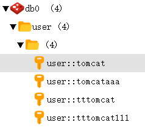

[TOC]


# 前言


# 一、SpringBoot 缓存整合 redis

## 1.数据库准备

创建数据库`spring-boot-sample` ，然后创建表`user`

```sql
DROP TABLE IF EXISTS `user`;
CREATE TABLE `user`  (
  `id` int(11) NOT NULL AUTO_INCREMENT  COMMENT '主键自增',
  `username` varchar(50) NOT NULL COMMENT '用户名',
  `password` varchar(64) NOT NULL COMMENT '密码',
  `email`    varchar(50) NOT NULL COMMENT '邮箱',
  `age` int (3) unsigned DEFAULT 3 COMMENT '年龄',
  `create_time` timestamp NOT NULL DEFAULT CURRENT_TIMESTAMP COMMENT '创建时间',
  `update_time` timestamp NOT NULL DEFAULT CURRENT_TIMESTAMP ON UPDATE CURRENT_TIMESTAMP COMMENT '更新时间',
  PRIMARY KEY (`id`)
) ENGINE=InnoDB DEFAULT CHARSET=utf8 COMMENT='用户表';
```


## 2.引入依赖

```xml
    <dependencies>
        <dependency>
            <groupId>org.springframework.boot</groupId>
            <artifactId>spring-boot-starter-web</artifactId>
        </dependency>
        <dependency>
            <groupId>org.springframework.boot</groupId>
            <artifactId>spring-boot-starter-data-jpa</artifactId>
        </dependency>
        <dependency>
            <groupId>mysql</groupId>
            <artifactId>mysql-connector-java</artifactId>
        </dependency>

        <!-- spring cache redis start -->
        <dependency>
            <groupId>org.springframework.boot</groupId>
            <artifactId>spring-boot-starter-cache</artifactId>
        </dependency>
        <dependency>
            <groupId>org.springframework.boot</groupId>
            <artifactId>spring-boot-starter-data-redis</artifactId>
        </dependency>
        <!-- lettuce pool 缓存连接池 -->
        <dependency>
            <groupId>org.apache.commons</groupId>
            <artifactId>commons-pool2</artifactId>
        </dependency>
        <!-- spring cache redis end -->
    </dependencies>
```


## 3.配置

### 3.1 `application.yml`

配置数据源、JPA、redis

```yml
server:
  port: 8088
  servlet:
    context-path: /

spring:
  # 配置数据源
  datasource:
    driver-class-name: com.mysql.cj.jdbc.Driver
    url: jdbc:mysql://localhost:3306/spring-boot-sample?useUnicode=true&characterEncoding=utf8&serverTimezone=GMT%2B8
    username: root
    password: root

  # 配置jpa
  jpa:
    database: mysql       # 数据库类型
    show-sql: true        # 打印sql语句
    hibernate:
      ddl-auto: update    # 加载 Hibernate时， 自动更新数据库结构

  # 配置redis
  redis:
    host: localhost
    port: 6379
    password:
    timeout: 500ms
    lettuce:
      pool:
        minIdle: 0
        maxIdle: 10
        maxWait: 10000
        max-active: 10

```


redis的默认配置可见`RedisProperties`


### 3.2 RedisConfiguration


```java
@Slf4j
@Configuration
@EnableCaching
public class RedisConfiguration extends CachingConfigurerSupport {
    private static final String CACHE_KEY_PREFIX = "cache";

    /**
     *  缓存生成key的策略
     *
     * @return keyGenerator
     */
    @Bean
    @Override
    public KeyGenerator keyGenerator() {
        return new KeyGenerator() {
            // 当没有指定缓存的 key时来根据类名、方法名和方法参数来生成key
            @Override
            public Object generate(Object target, Method method, Object... params) {
                StringBuilder sb = new StringBuilder();
                sb.append(CACHE_KEY_PREFIX)
                        .append(":").append(target.getClass().getName())
                        .append(":").append(method.getName());
                if(params.length > 0) {
                    sb.append('[');
                    for (Object obj : params) {
                        sb.append(obj.toString());
                    }
                    sb.append(']');
                }
                System.out.println("keyGenerator=" + sb.toString());
                return sb.toString();
            }
        };
    }

    /**
     * 配置使用注解的时候缓存配置
     */
    @Bean
    public CacheManager cacheManager(RedisConnectionFactory redisConnectionFactory) {
        RedisCacheWriter cacheWriter =  RedisCacheWriter.nonLockingRedisCacheWriter(redisConnectionFactory);

        RedisCacheConfiguration defaultCacheConfig = RedisCacheConfiguration.defaultCacheConfig()
                //设置缓存的默认超时时间：30分钟
                .entryTtl(Duration.ofMinutes(30L))
                //如果是空值，不缓存
                .disableCachingNullValues()
                //设置key序列化器
                .serializeKeysWith(RedisSerializationContext.SerializationPair.fromSerializer(new StringRedisSerializer()))
                //设置value序列化器
                .serializeValuesWith(RedisSerializationContext.SerializationPair.fromSerializer(new GenericJackson2JsonRedisSerializer()));

        return RedisCacheManager.builder(cacheWriter)
                .cacheDefaults(defaultCacheConfig)
                .build();
    }

    /**
     * 默认情况下的模板只能支持RedisTemplate<String, String>，也就是只能存入字符串，因此支持序列化
     */
    @Bean
    public RedisTemplate<String, Object> redisCacheTemplate(RedisConnectionFactory redisConnectionFactory) {
        RedisTemplate<String, Object> template = new RedisTemplate<>();
        template.setKeySerializer(new StringRedisSerializer());
        template.setValueSerializer(new GenericJackson2JsonRedisSerializer());
        template.setConnectionFactory(redisConnectionFactory);
        return template;
    }


    @Bean
    @Override
    public CacheErrorHandler errorHandler() {
        // 异常处理，当Redis发生异常时，打印日志，但是程序正常走
        log.info("初始化 -> [{}]", "Redis CacheErrorHandler");
        return new CacheErrorHandler() {
            @Override
            public void handleCacheGetError(RuntimeException e, Cache cache, Object key) {
                log.error("Redis occur handleCacheGetError：key -> [{}]", key, e);
            }

            @Override
            public void handleCachePutError(RuntimeException e, Cache cache, Object key, Object value) {
                log.error("Redis occur handleCachePutError：key -> [{}]；value -> [{}]", key, value, e);
            }

            @Override
            public void handleCacheEvictError(RuntimeException e, Cache cache, Object key) {
                log.error("Redis occur handleCacheEvictError：key -> [{}]", key, e);
            }

            @Override
            public void handleCacheClearError(RuntimeException e, Cache cache) {
                log.error("Redis occur handleCacheClearError：", e);
            }
        };
    }
    
}
```


## 4.业务实现

### 4.1 entity

- BaseEntity

  ```java
  @Data
  @MappedSuperclass  // 声明子类可继承基类字段
  @EntityListeners(AuditingEntityListener.class)   // 监听实体类变更
  public class BaseEntity {
  
  	@Id
  	@GeneratedValue(strategy = GenerationType.IDENTITY)
  	private Long id;
  
  	@CreatedDate  // 自动填充 CreatedDate
  	private LocalDateTime createTime;
  
  	@LastModifiedDate // 自动填充 LastModifiedDate
  	private LocalDateTime updateTime;
  }
  ```
  
  
  
- User

  ```java
  @Data
  @NoArgsConstructor
  @AllArgsConstructor
  @Entity
  @Table(name = "user")
  @DynamicInsert
  public class User extends BaseEntity{
  
      private String username;
  
      private String password;
  
      private String email;
  
      private Integer age;
  
  }
  
  ```
  
  


### 4.2 UserRepository

```java
@Repository
public interface UserRepository extends JpaRepository<User, Long> {

    /**
     * 查询年龄大于等于指定年龄的用户
     * @param age 年龄
     * @return userList
     */
    List<User> findByAgeGreaterThanEqualOrderById(Integer age);

    /**
     * 根据用户名查询用户信息
     *
     * @param username 用户名
     * @return userList
     */
    List<User> findAllByUsername(String username);

    User findByUsername(String username);


    /**
     * 根据用户名模糊查询
     * @param username username
     * @return userList
     */
    List<User> findByUsernameLike(String username);

    /**
     * 模糊查询
     * @param username
     * @return
     */
    List<User> findByUsernameContaining(String username);

    void deleteByUsername(String username);
}

```


### 4.3.service

- UserService

  ```java
  public interface UserService {
  
  	User save(User user);
  
  	void remove(String id);
  
  	User findByUsername(User user);
  
  }
  
  ```
  
  


- UserServiceImpl

  ```java
  @Slf4j
  @Service
  @CacheConfig(cacheNames = "user")
  public class UserServiceImpl implements UserService {
  
      UserRepository userRepository;
  
      @Autowired
      public UserServiceImpl(UserRepository userRepository) {
          this.userRepository = userRepository;
      }
  
      @Override
      @CachePut(key = "#user.username")
      public User save(User user) {
          User u = userRepository.save(user);
          log.info("新增：缓存用户，用户id为:{}", u.getId());
          return u;
      }
  
  
      @Override
      @CacheEvict(key = "#p0")
      public void remove(String username) {
          log.info("删除：删除缓存，用户username为:{}", username);
          userRepository.deleteByUsername(username);
      }
  
      @Override
      @Cacheable(key = "#user.username")
      public User findByUsername(User user) {
          user = userRepository.findByUsername(user.getUsername());
          log.info("查询：缓存用户，用户id为:{}", user.getId());
          return user;
      }
  
  }
  
  ```
  
  


## 5.单元测试

- UserServiceTest

```java
@RunWith(SpringRunner.class)
@SpringBootTest
@Transactional
@Rollback
@Slf4j
class UserServiceTest {

    @Autowired
    UserService userService;


    @Test
    public void testCache() {
        User user0 = new User("aatomcat000", "password", "aatomcat000@qq.com", 20);
        List<User> userToAddList = new ArrayList<>();
        userToAddList.add(user0);
        userToAddList.add(new User("tomcat", "password", "tomcat@qq.com", 21));
        userToAddList.add(new User("tttomcat", "password", "tttomcat@qq.com", 22));
        userToAddList.add(new User("tttomcat111", "password", "tttomcat111@qq.com", 23));
        userToAddList.add(new User("tomcataaa", "password", "tomcataaa@qq.com", 24));

        // 新增用户
        userToAddList.forEach(user -> {
            userService.save(user);
        });
        log.info("==========新增用户完毕============");

        User user1 = userService.findByUsername(user0);
        User user2 = userService.findByUsername(user0);
        User user3 = userService.findByUsername(user0);

        userService.remove(user0.getUsername());
    }
}
```


运行测试类，发现会输出如下日志，而`userService.findByUsername(user0)` 的日志却没有输出，说明走了缓存

```
2020-03-25 01:17:48.211  INFO 18952 --- [           main] c.r.s.s.c.r.s.impl.UserServiceImpl       : 新增：缓存用户，用户id为:32
2020-03-25 01:17:48.999  INFO 18952 --- [           main] io.lettuce.core.EpollProvider            : Starting without optional epoll library
2020-03-25 01:17:49.003  INFO 18952 --- [           main] io.lettuce.core.KqueueProvider           : Starting without optional kqueue library
Hibernate: insert into user (age, email, password, username) values (?, ?, ?, ?)
2020-03-25 01:17:51.469  INFO 18952 --- [           main] c.r.s.s.c.r.s.impl.UserServiceImpl       : 新增：缓存用户，用户id为:33
Hibernate: insert into user (age, email, password, username) values (?, ?, ?, ?)
2020-03-25 01:17:51.478  INFO 18952 --- [           main] c.r.s.s.c.r.s.impl.UserServiceImpl       : 新增：缓存用户，用户id为:34
Hibernate: insert into user (age, email, password, username) values (?, ?, ?, ?)
2020-03-25 01:17:51.482  INFO 18952 --- [           main] c.r.s.s.c.r.s.impl.UserServiceImpl       : 新增：缓存用户，用户id为:35
Hibernate: insert into user (age, email, password, username) values (?, ?, ?, ?)
2020-03-25 01:17:51.488  INFO 18952 --- [           main] c.r.s.s.c.r.s.impl.UserServiceImpl       : 新增：缓存用户，用户id为:36
2020-03-25 01:17:51.497  INFO 18952 --- [           main] c.r.s.s.c.redis.service.UserServiceTest  : ==========新增用户完毕============
2020-03-25 01:17:51.619  INFO 18952 --- [           main] c.r.s.s.c.r.s.impl.UserServiceImpl       : 删除：删除缓存，用户username为:aatomcat000
```


然后也可查看redis，只有4条记录




# 参考资料

> - [Springboot 2.X中Spring-cache与redis整合](https://blog.csdn.net/johnf_nash/article/details/87526631)
> - [【第三章】SpringBoot2.x集成Redis之-缓存](https://juejin.im/post/5d7260026fb9a06af50feedf)
> - [SpringBoot 2.X @Cacheable，redis-cache 如何根据key设置缓存时间？](https://segmentfault.com/q/1010000015203664)

