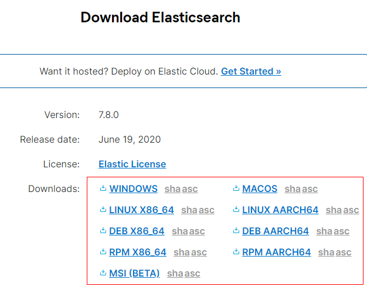
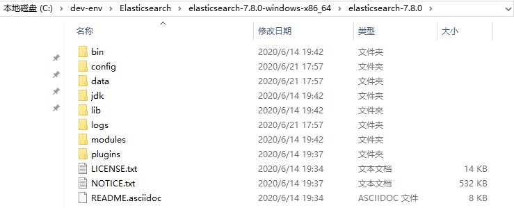
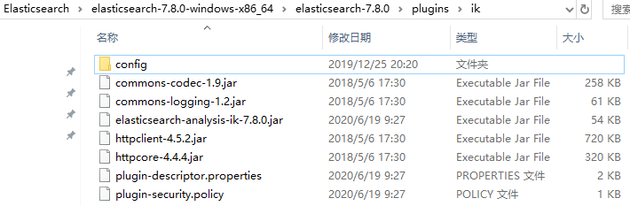

# Elasticsearch安装及配置

[toc]

## 一、Elasticsearch安装及配置

### 1.安装Elasticsearch

Elasticsearch 的安装很简单，直接前往官网下载相应系统的二进制压缩包

> https://www.elastic.co/cn/downloads/elasticsearch




然后解压即可




### 2.配置

 config目录下的文件即为 Elasticsearch 的相关配置文件，基本配置文件为 `elasticsearch.yml`，基本的内容解读如下

```yml
# ======================== Elasticsearch Configuration =========================
#
# NOTE: Elasticsearch comes with reasonable defaults for most settings.
#       Before you set out to tweak and tune the configuration, make sure you
#       understand what are you trying to accomplish and the consequences.
#
# The primary way of configuring a node is via this file. This template lists
# the most important settings you may want to configure for a production cluster.
#
# Please consult the documentation for further information on configuration options:
# https://www.elastic.co/guide/en/elasticsearch/reference/index.html
#
# ---------------------------------- Cluster : 集群配置 -----------------------------------
#
# Use a descriptive name for your cluster:
# 配置集群名称，默认名称为elasticsearch，启动elasticsearch后，浏览器访问http://localhost:9200，在返回的数据中，就有集群名字
#
#cluster.name: my-application
#
# ------------------------------------ Node : 节点配置------------------------------------
#
# Use a descriptive name for the node:
# 配置节点名称,默认名称为 $hostname
#
#node.name: node-1
#
# Add custom attributes to the node:
# 给节点添加自定义属性
#
#node.attr.rack: r1
#
# ----------------------------------- Paths : 路径配置------------------------------------
#
# Path to directory where to store the data (separate multiple locations by comma):
# 数据存放目录，默认是elasticsearch下的data目录，
# 可以指定多个目录，用,隔开，如:path.data:/path/data1,/path/data2
#
#path.data: /path/to/data
#
# Path to log files:
# 日志存放目录，默认为elasticsearch下的logs目录
#
#path.logs: /path/to/logs
#
# ----------------------------------- Memory : 内存配置 -----------------------------------
#
# Lock the memory on startup:
# 配置是否锁住内存。当jvm开始swapping时，elasticsearch的效率降低，为了避免这种情况，可以设置为true。
#
#bootstrap.memory_lock: true
#
# Make sure that the heap size is set to about half the memory available
# on the system and that the owner of the process is allowed to use this
# limit.
#
# Elasticsearch performs poorly when the system is swapping the memory.
#
# ---------------------------------- Network : 网络配置-----------------------------------
#
# Set the bind address to a specific IP (IPv4 or IPv6):
# 设置绑定的ip地址
#
#network.host: 192.168.0.1
#
# Set a custom port for HTTP:
# 配置对外提供服务的http端口号
#
#http.port: 9200
#
# For more information, consult the network module documentation.
#
# --------------------------------- Discovery ----------------------------------
#
# Pass an initial list of hosts to perform discovery when this node is started:
# The default list of hosts is ["127.0.0.1", "[::1]"]
# 设置集群中master节点的初始列表，通过这个配置可以发现新加入的集群的节点。  
#
#discovery.seed_hosts: ["host1", "host2"]
#
# Bootstrap the cluster using an initial set of master-eligible nodes:
#
#cluster.initial_master_nodes: ["node-1", "node-2"]
#
# For more information, consult the discovery and cluster formation module documentation.
#
# ---------------------------------- Gateway -----------------------------------
#
# Block initial recovery after a full cluster restart until N nodes are started:
# 当n个节点启动后，再开始集群的恢复
#
#gateway.recover_after_nodes: 3
#
# For more information, consult the gateway module documentation.
#
# ---------------------------------- Various -----------------------------------
#
# Require explicit names when deleting indices:
#
#action.destructive_requires_name: true

```


这里我们主要配置下集群和节点的名称

```yaml
# ======================== Elasticsearch Configuration =========================
#
# NOTE: Elasticsearch comes with reasonable defaults for most settings.
#       Before you set out to tweak and tune the configuration, make sure you
#       understand what are you trying to accomplish and the consequences.
#
# The primary way of configuring a node is via this file. This template lists
# the most important settings you may want to configure for a production cluster.
#
# Please consult the documentation for further information on configuration options:
# https://www.elastic.co/guide/en/elasticsearch/reference/index.html
#
# ---------------------------------- Cluster : 集群配置 -----------------------------------
#
# Use a descriptive name for your cluster:
# 配置集群名称，默认名称为elasticsearch，启动elasticsearch后，浏览器访问http://localhost:9200，在返回的数据中，就有集群名字
#
#cluster.name: my-application
cluster.name: cluster-1
#
# ------------------------------------ Node : 节点配置------------------------------------
#
# Use a descriptive name for the node:
# 配置节点名称,默认名称为 $hostname
#
#node.name: node-1
node.name: node-1
#
# Add custom attributes to the node:
# 给节点添加自定义属性
#
#node.attr.rack: r1
#
# ----------------------------------- Paths : 路径配置------------------------------------
#
# Path to directory where to store the data (separate multiple locations by comma):
# 数据存放目录，默认是elasticsearch下的data目录，
# 可以指定多个目录，用,隔开，如:path.data:/path/data1,/path/data2
#
#path.data: /path/to/data
#
# Path to log files:
# 日志存放目录，默认为elasticsearch下的logs目录
#
#path.logs: /path/to/logs
#
# ----------------------------------- Memory : 内存配置 -----------------------------------
#
# Lock the memory on startup:
# 配置是否锁住内存。当jvm开始swapping时，elasticsearch的效率降低，为了避免这种情况，可以设置为true。
#
#bootstrap.memory_lock: true
#
# Make sure that the heap size is set to about half the memory available
# on the system and that the owner of the process is allowed to use this
# limit.
#
# Elasticsearch performs poorly when the system is swapping the memory.
#
# ---------------------------------- Network : 网络配置-----------------------------------
#
# Set the bind address to a specific IP (IPv4 or IPv6):
# 设置绑定的ip地址
#
#network.host: 192.168.0.1
#
# Set a custom port for HTTP:
# 配置对外提供服务的http端口号
#
#http.port: 9200
#
# For more information, consult the network module documentation.
#
# --------------------------------- Discovery ----------------------------------
#
# Pass an initial list of hosts to perform discovery when this node is started:
# The default list of hosts is ["127.0.0.1", "[::1]"]
# 设置集群中master节点的初始列表，通过这个配置可以发现新加入的集群的节点。  
#
#discovery.seed_hosts: ["host1", "host2"]
#
# Bootstrap the cluster using an initial set of master-eligible nodes:
#
#cluster.initial_master_nodes: ["node-1", "node-2"]
#
# For more information, consult the discovery and cluster formation module documentation.
#
# ---------------------------------- Gateway -----------------------------------
#
# Block initial recovery after a full cluster restart until N nodes are started:
# 当n个节点启动后，再开始集群的恢复
#
#gateway.recover_after_nodes: 3
#
# For more information, consult the gateway module documentation.
#
# ---------------------------------- Various -----------------------------------
#
# Require explicit names when deleting indices:
#
#action.destructive_requires_name: true

```


### 3.运行

（1）windows用户直接双击bin目录下的`elasticsearch.bat`，即可启动Elasticsearch。

（2）启动成功后，浏览器访问   http://localhost:9200/   ，即可返回es信息

```json
{
    "name": "node-1",
    "cluster_name": "cluster-1",
    "cluster_uuid": "kr9pAHnyReGwvVAiLX6GjQ",
    "version": {
        "number": "7.8.0",
        "build_flavor": "default",
        "build_type": "zip",
        "build_hash": "757314695644ea9a1dc2fecd26d1a43856725e65",
        "build_date": "2020-06-14T19:35:50.234439Z",
        "build_snapshot": false,
        "lucene_version": "8.5.1",
        "minimum_wire_compatibility_version": "6.8.0",
        "minimum_index_compatibility_version": "6.0.0-beta1"
    },
    "tagline": "You Know, for Search"
}
```


## 二、安装 elasticsearch-head 插件

elasticsearch-head 插件是 elastic search 集群的 web 前端图形化工具，通过它可以方便的进行Elasticsearch的管理。

> github：https://github.com/mobz/elasticsearch-head


### 1.安装NodeJS

elasticsearch-head 使用NodeJs 开发，因此需要安装 NodeJs，直接官网下载安装即可

### 2.修改 **elasticsearch.yml** 

为了让head插件能连上 elasticsearch ，需要配置 elasticsearch 允许跨域，修改 `conf/elasticsearch.yml`

```yml
# 配置 elasticsearch 允许跨域，这样head插件可以访问es
http.cors.enabled: true
http.cors.allow-origin: "*"
```

### 3.运行 elasticsearch-head

>  github地址：https://github.com/mobz/elasticsearch-head 

参照官方文档，可通过如下方式运行 elasticsearch-head

```bash
# 克隆 elasticsearch-head
git clone git://github.com/mobz/elasticsearch-head.git

cd elasticsearch-head
# 安装依赖
npm install
# 运行 elasticsearch-head 前端项目
npm run start
```


然后打开 http://localhost:9100/


## 三、安装 ik 中文分词插件

> - 请参见官方文档：https://github.com/medcl/elasticsearch-analysis-ik
> - ik 分词插件版本与 ES 版本对照，请查阅：https://github.com/medcl/elasticsearch-analysis-ik#versions

安装方式有如下两种：

##### 手动安装：

> （1）在 ES 的 plugins 目录下创建 ik 目录
>
> ```bash
> cd ./plugins && mkdir ik
> ```
>
> （2）下载编译包到 ik 目录，下载地址：https://github.com/medcl/elasticsearch-analysis-ik/releases
>
> （3）解压下载的压缩包
>
> ```bash
> unzip elasticsearch-analysis-ik-{ ES 版本 }.zip
> ```
>
> 目录结构如下：
>
> 
>
> （4）重启 ES


##### 自动安装：

> （1）使用 ES 提供的插件安装方式安装，替换下面的 ES 版本，具体信息可以去 https://github.com/medcl/elasticsearch-analysis-ik/releases
>
> ```bash
> ./bin/elasticsearch-plugin install https://github.com/medcl/elasticsearch-analysis-ik/releases/download/{ ES 版本 }/elasticsearch-analysis-ik-{ ES 版本 }.zip
> 
> ```
>
> （2）重启 ES


## 参考资料

> - [ElasticSearch 笔记](https://xkcoding.com/2018/01/12/elasticsearch_note.html)
> - [elasticsearch安装与配置_江南一点雨](https://blog.csdn.net/u012702547/article/details/83116699 )
> - [ElasticSearch安装和配置](https://blog.csdn.net/liberalliushahe/article/details/79092313)

