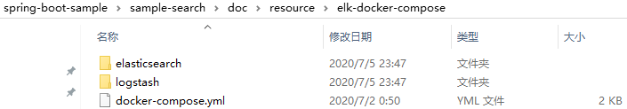
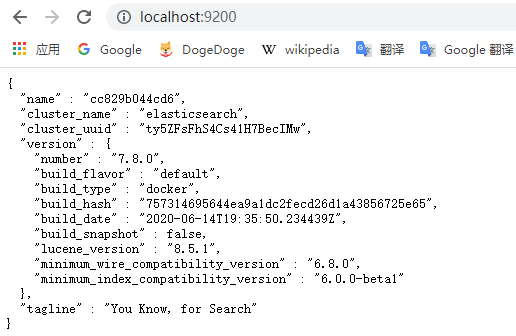
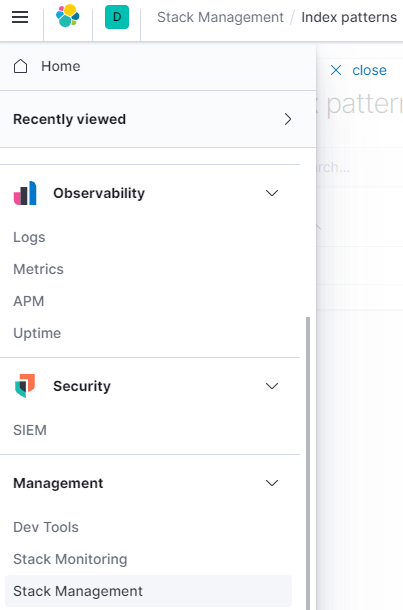
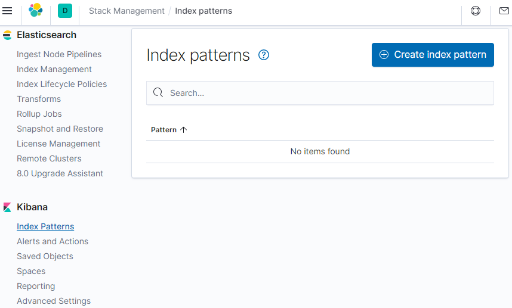
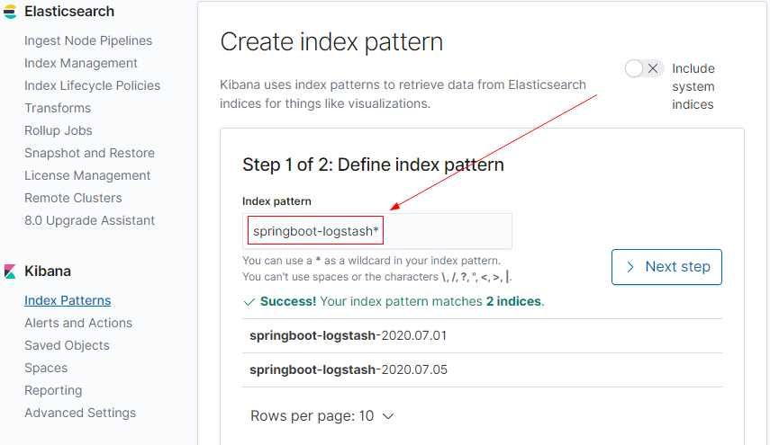
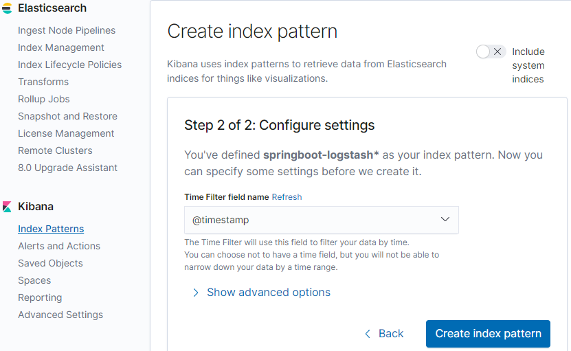
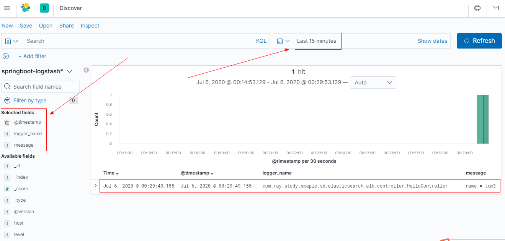

# ELK日志平台搭建教程

[toc]


## 推荐项目

> - [deviantony/docker-elk](https://github.com/deviantony/docker-elk)
> - [Ceelog/learn-elk](https://github.com/Ceelog/learn-elk)

## 推荐阅读

> - [SpringBoot应用整合ELK实现日志收集](https://juejin.im/post/5d2738a2f265da1bac404299)
> - [搭建 ELK 实时日志平台并在 Spring Boot 和 Nginx 项目中使用](https://www.ibm.com/developerworks/cn/java/build-elk-and-use-it-for-springboot-and-nginx/index.html)
> - [Spring Cloud集成ELK完成日志收集实战（elasticsearch、logstash、kibana）](https://blog.csdn.net/zjx2016/article/details/104311744)


其他资料：

> - [SpringBoot使用ELK日志收集](https://juejin.im/post/5c78c66c6fb9a049e702cf3e)
> - [芋道 Spring Boot 日志平台 ELK + Filebeat 入门](http://www.iocoder.cn/Spring-Boot/ELK/)
> - [ELK入门使用-与springboot集成](https://www.cnblogs.com/woshimrf/p/elk-springboot.html)
> - [ELK快速搭建日志平台](https://www.cnblogs.com/cjsblog/p/9517060.html)
> - [windows10上搭建ELK实践](https://blog.csdn.net/qrainly/article/details/104726198/)
> - 


## 概述

> 本文转自：[SpringBoot应用整合ELK实现日志收集](https://juejin.im/post/5d2738a2f265da1bac404299)

ELK即Elasticsearch、Logstash、Kibana，组合起来可以搭建线上日志系统，本文主要讲解使用ELK来收集SpringBoot应用产生的日志。

> - Elasticsearch：用于存储收集到的日志信息；
> - Logstash：用于收集日志，SpringBoot应用整合了Logstash以后会把日志发送给Logstash,Logstash再把日志转发给Elasticsearch；
> - Kibana：通过Web端的可视化界面来查看日志。

本文只是简单实现了一下elk，生产上不推荐此方式，只做入门测试使用，日志流转流程为： 应用 -> logstash -> es，然后Kibana再展示es数据

## 一、使用Docker Compose 搭建ELK环境

### 1.目录结构

目录结构见：[resource\elk-docker-compose](./resource/elk-docker-compose)




### 2.docker-compose.yml

```yml
version: '3'
services:
  elasticsearch:
    image: elasticsearch:7.8.0
    container_name: elasticsearch
    environment:
      - "cluster.name=elasticsearch" #设置集群名称为elasticsearch
      - "discovery.type=single-node" #以单一节点模式启动
      - "ES_JAVA_OPTS=-Xms512m -Xmx512m" #设置使用jvm内存大小
    volumes:
      - ./elasticsearch/plugins:/usr/share/elasticsearch/plugins #插件文件挂载
      - ./elasticsearch/data:/usr/share/elasticsearch/data #数据文件挂载
    ports:
      - 9200:9200
  kibana:
    image: kibana:7.8.0
    container_name: kibana
    links:
      - elasticsearch:es #可以用es这个域名访问elasticsearch服务
    depends_on:
      - elasticsearch #kibana在elasticsearch启动之后再启动
    environment:
      - "elasticsearch.hosts=http://es:9200" #设置访问elasticsearch的地址
    ports:
      - 5601:5601
  logstash:
    image: logstash:7.8.0
    container_name: logstash
    volumes:
      - ./logstash/logstash.conf:/usr/share/logstash/pipeline/logstash.conf #挂载logstash的配置文件
    depends_on:
      - elasticsearch #kibana在elasticsearch启动之后再启动
    links:
      - elasticsearch:es #可以用es这个域名访问elasticsearch服务
    ports:
      - 4560:4560
```


### 3.logstash.conf

配置 logstash监听 4560 端口的输入，并将内容输出到 es 中

```
input {
  tcp {
    mode => "server"
    host => "0.0.0.0"
    port => 4560
    codec => json_lines
  }
}
output {
  elasticsearch {
    hosts => "es:9200"
    index => "springboot-logstash-%{+YYYY.MM.dd}"
  }
}
```


### 4.启动elk

（1）然后执行如下命令，按照配置文件中的编排顺序依次启动容器

```bash
docker-compose up -d
```


（2）访问 http://localhost:9200/，验证es启动成功



（3）访问 http://localhost:5601/ ， 验证kibana 启动成功


## 二、SpringBoot应用集成Logstash

### 1.引入依赖

```xml
<?xml version="1.0" encoding="UTF-8"?>
<project xmlns="http://maven.apache.org/POM/4.0.0"
         xmlns:xsi="http://www.w3.org/2001/XMLSchema-instance"
         xsi:schemaLocation="http://maven.apache.org/POM/4.0.0 http://maven.apache.org/xsd/maven-4.0.0.xsd">
    <parent>
        <artifactId>sample-search-elasticsearch</artifactId>
        <groupId>com.ray.study.sample</groupId>
        <version>0.0.1-SNAPSHOT</version>
    </parent>
    <modelVersion>4.0.0</modelVersion>

    <artifactId>sample-elk</artifactId>

    <dependencies>
        <dependency>
            <groupId>org.springframework.boot</groupId>
            <artifactId>spring-boot-starter-web</artifactId>
        </dependency>
        <!-- logback -->
        <dependency>
            <groupId>ch.qos.logback</groupId>
            <artifactId>logback-classic</artifactId>
        </dependency>
        <!-- logstash -->
        <dependency>
            <groupId>net.logstash.logback</groupId>
            <artifactId>logstash-logback-encoder</artifactId>
            <version>5.3</version>
        </dependency>
    </dependencies>

    <build>
        <plugins>
            <plugin>
                <groupId>org.springframework.boot</groupId>
                <artifactId>spring-boot-maven-plugin</artifactId>
            </plugin>
        </plugins>
    </build>
</project>
```


### 2.logback-spring.xml

添加配置文件`logback-spring.xml`让logback的日志输出到 logstash

```xml
<?xml version="1.0" encoding="UTF-8"?>
<!DOCTYPE configuration>
<configuration>
    <include resource="org/springframework/boot/logging/logback/defaults.xml"/>
    <include resource="org/springframework/boot/logging/logback/console-appender.xml"/>
    <!--应用名称-->
    <property name="APP_NAME" value="mall-admin"/>
    <!--日志文件保存路径-->
    <property name="LOG_FILE_PATH" value="${LOG_FILE:-${LOG_PATH:-${LOG_TEMP:-${java.io.tmpdir:-/tmp}}}/logs}"/>
    <contextName>${APP_NAME}</contextName>
    <!--每天记录日志到文件appender-->
    <appender name="FILE" class="ch.qos.logback.core.rolling.RollingFileAppender">
        <rollingPolicy class="ch.qos.logback.core.rolling.TimeBasedRollingPolicy">
            <fileNamePattern>${LOG_FILE_PATH}/${APP_NAME}-%d{yyyy-MM-dd}.log</fileNamePattern>
            <maxHistory>30</maxHistory>
        </rollingPolicy>
        <encoder>
            <pattern>${FILE_LOG_PATTERN}</pattern>
        </encoder>
    </appender>
    <!--输出到logstash的appender-->
    <appender name="LOGSTASH" class="net.logstash.logback.appender.LogstashTcpSocketAppender">
        <!--可以访问的logstash日志收集端口-->
        <destination>localhost:4560</destination>
        <encoder charset="UTF-8" class="net.logstash.logback.encoder.LogstashEncoder"/>
    </appender>
    <root level="INFO">
        <appender-ref ref="CONSOLE"/>
        <appender-ref ref="FILE"/>
        <appender-ref ref="LOGSTASH"/>
    </root>
</configuration>

```


注意：

> appender节点下的destination需要改成你自己的logstash服务地址，我这里是本地，所以是localhost


### 3.启动类

```java
@SpringBootApplication
public class ElkApplication {

    public static void main(String[] args) {
        SpringApplication.run(ElkApplication.class, args);
    }
}

```


### 4.HelloController

写一个Controller模拟应用中输出日志

```java
@RestController
@RequestMapping("/hello")
@Slf4j
public class HelloController {

    @GetMapping("/{name}")
    public String hi(@PathVariable(value = "name") String name) {
        log.info( "name = {}" , name );
        return "hi , " + name;
    }

}
```


### 5.最终效果

#### 5.1 写日志

首先浏览器访问HelloController，这时logback日志会输出到 logstash，再通过 logstash 输出到 es中了

> http://localhost:8080/hello/tom3


#### 5.2 Kibana 展示es日志

刚刚我们的日志已经写入到es了，还需要在Kibana中将es 日志展示出来

##### 5.2.1 Kibana中创建索引模式

（1）浏览器访问 http://localhost:5601/ ，即可进入Kibana，然后在如下菜单栏中，



依次选择 Management  ->  Stack Management  -> Index patterns，出现下图




（2）然后添加索引模式



然后选择按时间过滤




##### 5.2.2 展示es日志

Kibana菜单栏，Kibana -> Discover




我们查看过去15分钟内的日志，并只选择 **@timestamp** 、 **logger_name**、**message** 字段进行展示，可以看到，这正是我们刚刚的应用日志

