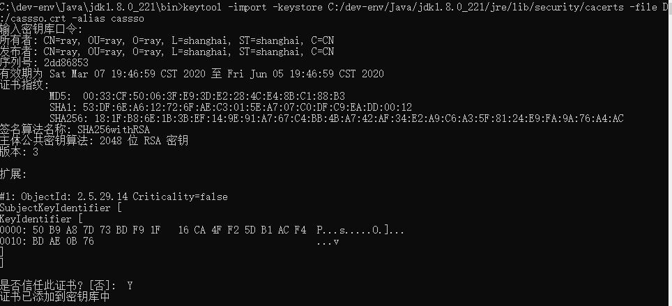
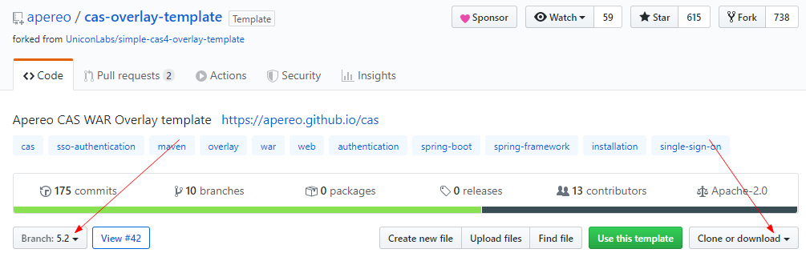
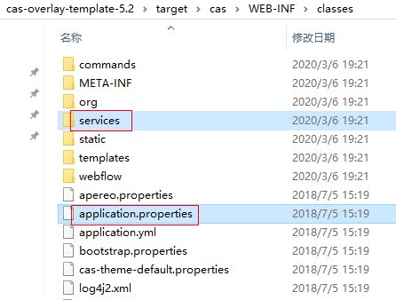
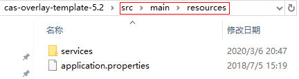
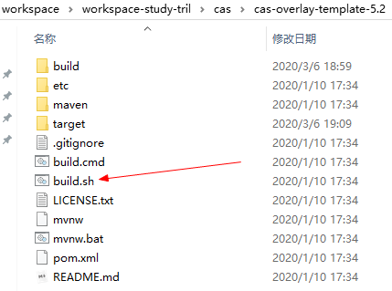
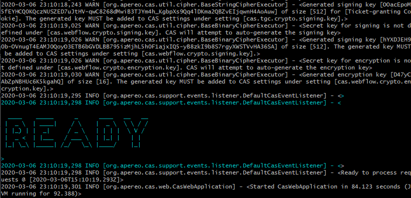
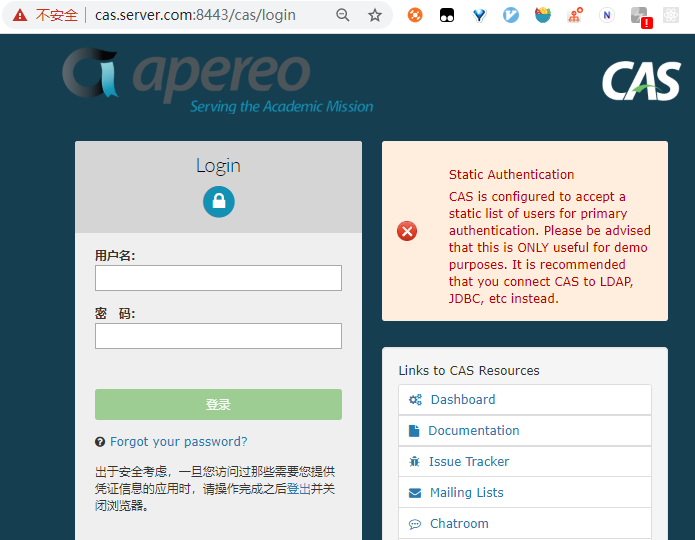
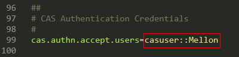
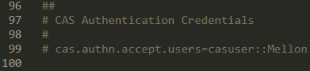

[toc]


# 前言


## 推荐阅读

> - [Springboot security cas整合方案-原理篇](https://www.cnblogs.com/question-sky/p/7061522.html)
> - [16.玩转Spring Boot 使用Spring security 集成CAS](https://blog.csdn.net/cl_andywin/article/details/53998986)
> - [springboot+cas单点登录](https://www.jianshu.com/p/67db23e9d005)
> - [Springboot+CAS单点登录](https://www.cnblogs.com/wlwl/p/10056067.html)


# 一、基于内存的认证

推荐阅读：

> - [CAS（一）搭建CAS - server服务器](https://blog.csdn.net/oumuv/article/details/83377945)    
> - 

其他参考：

> - [[CAS 5.2.x 单点登录 - 搭建服务端和客户端](https://segmentfault.com/a/1190000013844049)]
> - [最强SSO单点登录教程(七)CAS-搭建CAS Server服务端(静态认证)](https://www.jianshu.com/p/2bd8f2b1db86)
> - [CAS 5.2.6 服务器(mysql持久化用户信息)和客户端搭建](https://abelard2008.github.io/2019/02/01/cas-server-client/)
> - [基于CAS的单点登录SSO: 改造cas-overlays-template支持MySQL数据库](https://blog.csdn.net/gobitan/article/details/77658727)

## 1.修改host文件，模拟跨域

修改`C:\Windows\System32\drivers\etc\hosts`文件，加入cas的域名映射

```
# cas test
# cas server 地址
127.0.0.1 cas.server.com
# cas client 地址
127.0.0.1 cas.client.com
```


## 2.创建和导入证书

> 注意：如果不需要HTTPS进行访问，则可以跳过创建/导入证书这一节。

（1）使用JDK自带的keytool工具生成证书

```
keytool -genkey -alias cassso -keyalg RSA -keystore D:/cassso.keystore
```

密码口令 cas-server


（2）导出证书

```
keytool -export -file D:/cassso.crt -alias cassso -keystore D:/cassso.keystore
```


（3）将证书导入到JDK中，出现如下图表示导出成功。注：这里输入密码是JDK的，如果没有修改过密码为：changeit

```
keytool -import -keystore C:/dev-env/Java/jdk1.8.0_221/jre/lib/security/cacerts -file D:/cassso.crt -alias cassso
```





## 3.下载源码

前往 [CAS WAR Overlay](https://github.com/apereo/cas-overlay-template) 的github地址，先选择 5.2 版本，然后下载源码





## 4.启动cas-server

### 4.1 编译并打包

执行如下命令，来编译并打包

```
./build.sh package
```


在此过程中可能出现如下异常：

- 找不到cas-server-webapp-tomcat-5.2.war包

> 可能是由于网络问题导致下载的war包有问题，可清空本地maven仓库中的这个war包所在的文件夹，然后重新运行`./build.sh package`


### 4.2 修改配置文件

（1）在生成的目录中（`target\cas\WEB-INF\classes`）复制两个文件




（2）再新建一个 `src\main\resources`目录将这两个文件拷贝进去




（3）修改 `application.properties`，配置证书与秘钥

```properties
server.ssl.key-store=D:/cassso.keystore
server.ssl.key-store-password=cas-server
server.ssl.key-password=cas-server
```


### 4.3 启动 cas-server

下载完成后，解压，然后打开 git bash 运行build.sh 来构建并启动cas-server

````
./build.sh run
````





出现下图则cas-server启动成功




### 4.4 cas 登录页

启动成功后，访问如下登录页：

> https://cas.server.com:8443/cas/login




右边的红色框是提示当前认证方式为静态认证

这里的用户名密码需使用`application.properies` 中配置的静态用户




# 二、基于数据库的认证

推荐阅读：

> [Cas 5.2.x版本使用 —— 单点登录JDBC认证（五）](http://www.ibloger.net/article/3119.html)


其他参考：

> - [CAS5.3单点登录（二）连接mysql数据库](https://blog.csdn.net/zzy730913/article/details/80825800)
> - [CAS 5.2.6 服务器(mysql持久化用户信息)和客户端搭建](https://abelard2008.github.io/2019/02/01/cas-server-client/)
> - [CAS之5.2x版本自定义JDBC认证-yellowcong](https://blog.csdn.net/yelllowcong/article/details/79541838?depth_1-utm_source=distribute.pc_relevant.none-task&utm_source=distribute.pc_relevant.none-task)
> - [CAS服务器5.2.6使用MySQL数据库验证](https://blog.csdn.net/weixin_43549578/article/details/91503070)
> - 


上一节，我们成功部署了cas-server，不过只能使用配置文件中配置的用户进行登录，这一节，我们将使用mysql数据库中的用户进行登录认证。


## 1.数据库准备

```sql
create table sys_user (
 `id` int(11) not null auto_increment,
 `username` varchar(30) not null,
 `password` varchar(64) not null,
 `email`    varchar(50),
 `address`  varchar(100),
 `age`      int,
 `expired` int,     
 `disabled` int,    
 `locked` int,      
  primary key (`id`)
) engine=innodb auto_increment=1 default charset=utf8;
```


明文MD5数据

```sql
-- 123
insert into sys_user values ('1', 'admin', '202cb962ac59075b964b07152d234b70', 'admin@foxmail.com', '广州天河', 24, 0, 0, 0);

-- 12345678
insert into sys_user values ('2', 'zhangsan', '25d55ad283aa400af464c76d713c07ad', 'zhangsan@foxmail.com', '广州越秀', 26, 0, 0, 0);

-- 1234
-- 禁用账户
insert into sys_user values ('3', 'zhaosi', '81dc9bdb52d04dc20036dbd8313ed055', 'zhaosi@foxmail.com', '广州海珠', 25, 0, 1, 0);

-- 12345
-- 过期账户
insert into sys_user values ('4', 'wangwu', '827ccb0eea8a706c4c34a16891f84e7b', 'wangwu@foxmail.com', '广州番禺', 27, 1, 0, 0);

-- 123
-- 锁定账户
insert into sys_user values ('5', 'boss', '202cb962ac59075b964b07152d234b70', 'boss@foxmail.com', '深圳', 30, 0, 0, 1);

```


未加密数据

```sql
insert into sys_user values ('6', 'tingfeng', 'tingfeng', 'admin@foxmail.com', '郑州东区', 24, 0, 0, 0);
```


## 2.修改application.properties

### 2.1 去掉静态验证

将 `application.properties`中配置的用户注释掉，如下图：




### 2.2 加入数据库的配置

在 `application.properties`中加入如下配置

```properties
##
# Query Database Authentication 数据库查询校验用户名开始
#
# 查询账号密码sql，必须包含密码字段
cas.authn.jdbc.query[0].sql=select * from sys_user where username=?
#指定上面的sql查询字段名（必须）
cas.authn.jdbc.query[0].fieldPassword=password
#指定过期字段，1为过期，若过期不可用（可选）
cas.authn.jdbc.query[0].fieldExpired=expired
#指定不可用字段段，1为不可用，需要修改密码（可选）
cas.authn.jdbc.query[0].fieldDisabled=disabled
#数据库方言hibernate的
cas.authn.jdbc.query[0].dialect=org.hibernate.dialect.MySQLDialect
#数据库驱动
cas.authn.jdbc.query[0].driverClass=com.mysql.jdbc.Driver
#数据库连接
cas.authn.jdbc.query[0].url=jdbc:mysql://localhost:3306/test?useUnicode=true&characterEncoding=UTF-8&autoReconnect=true&useSSL=false&serverTimezone=UTC
cas.authn.jdbc.query[0].user=root
cas.authn.jdbc.query[0].password=root

#默认加密策略，通过encodingAlgorithm来指定算法，默认NONE不加密
cas.authn.jdbc.query[0].passwordEncoder.type=DEFAULT
cas.authn.jdbc.query[0].passwordEncoder.characterEncoding=UTF-8
cas.authn.jdbc.query[0].passwordEncoder.encodingAlgorithm=MD5
#
# Query Database Authentication 数据库查询校验用户名结束
##
```


## 3.加入数据库相关依赖

在 `pom.xml`中加入数据库相关依赖

```xml
    <dependencies>
        <dependency>
            <groupId>mysql</groupId>
            <artifactId>mysql-connector-java</artifactId>
            <version>6.0.6</version>
        </dependency>
        <dependency>
            <groupId>org.apereo.cas</groupId>
            <artifactId>cas-server-support-jdbc</artifactId>
            <version>${cas.version}</version>
        </dependency>
        <dependency>
            <groupId>org.apereo.cas</groupId>
            <artifactId>cas-server-support-jdbc-drivers</artifactId>
            <version>${cas.version}</version>
        </dependency>
    </dependencies>
```


## 4.重启cas-server

接着重启cas-server，然后进行登录即可


# 参考资料


