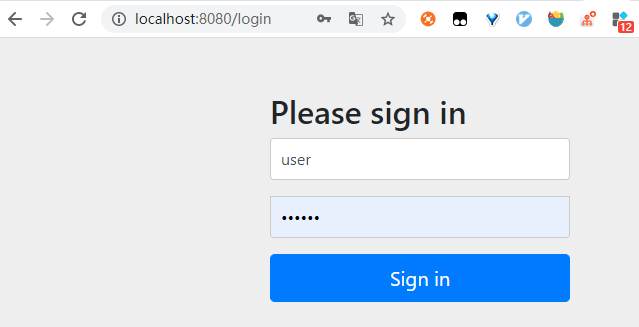
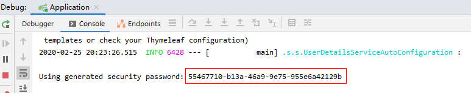

[toc]


# 前言

## 推荐阅读

> - [SpringBoot + Spring Security 学习笔记（一）自定义基本使用及个性化登录配置](https://www.cnblogs.com/mujingyu/p/10701026.html)


# 一、快速开始

## 1.使用自动生成的密码

（1）创建一个 springboot 工程

```xml
 <groupId>com.ray.study.sample</groupId>
 <artifactId>spring-security-quick-start</artifactId>
 <version>0.0.1-SNAPSHOT</version>
```


然后引入如下依赖

```xml
    <dependencies>
        <dependency>
            <groupId>org.springframework.boot</groupId>
            <artifactId>spring-boot-starter-web</artifactId>
        </dependency>
        <dependency>
            <groupId>org.springframework.boot</groupId>
            <artifactId>spring-boot-starter-security</artifactId>
        </dependency>
        <dependency>
            <groupId>org.springframework.boot</groupId>
            <artifactId>spring-boot-starter-thymeleaf</artifactId>
        </dependency>
    </dependencies>
```


（2）编写一个简单的Controller

```java
@RestController
@RequestMapping("/user")
public class UserController {
    @GetMapping
    public String getUsers() {
        return "Hello Spring Security";
    }
}
```

（3）启动项目，然后浏览器访问 http://localhost:8080/user ，发现页面自动被重定向到登录页面




在`SecurityProperties`类中，我们可以看到用户名密码的默认值

```java
@ConfigurationProperties(
    prefix = "spring.security"
)
public class SecurityProperties {

    public static class User {
            private String name = "user";
            private String password = UUID.randomUUID().toString();
            private List<String> roles = new ArrayList();
            private boolean passwordGenerated = true;
    }
}
```

并且在项目启动过程中，控制台日志中也会打印自动生成的随机的密码




于是使用这个用户名密码进行登录，登录成功之后，即可访问资源。


## 2.自定义默认用户名和密码

在 `application.yml` 中加入如下配置

```yml
spring:
  security:
    user:
      name: "admin"
      password: "admin"
```

重启应用之后，即可使用 `admin/admin`进行登录


## 3.基于内存的认证

（1）将 `application.yml` 中配置的用户名密码注释掉

```yml
#spring:
#  security:
#    user:
#      name: "admin"
#      password: "admin"
```


（2）新建一个类，继承自`WebSecurityConfigurerAdapter`

```java
package com.ray.study.smaple.security.config;

import org.springframework.context.annotation.Bean;
import org.springframework.context.annotation.Configuration;
import org.springframework.security.config.annotation.authentication.builders.AuthenticationManagerBuilder;
import org.springframework.security.config.annotation.method.configuration.EnableGlobalMethodSecurity;
import org.springframework.security.config.annotation.web.builders.HttpSecurity;
import org.springframework.security.config.annotation.web.builders.WebSecurity;
import org.springframework.security.config.annotation.web.configuration.EnableWebSecurity;
import org.springframework.security.config.annotation.web.configuration.WebSecurityConfigurerAdapter;
import org.springframework.security.core.userdetails.UserDetailsService;
import org.springframework.security.crypto.factory.PasswordEncoderFactories;
import org.springframework.security.crypto.password.PasswordEncoder;

/**
 * WebSecurityConfiguration
 *
 * @author ray
 * @date 2020/2/25
 */
@Configuration
@EnableWebSecurity
@EnableGlobalMethodSecurity(prePostEnabled = true)
public class WebSecurityConfiguration extends WebSecurityConfigurerAdapter {

    @Override
    protected void configure(AuthenticationManagerBuilder auth) throws Exception {
        // 基于内存的认证
        auth.inMemoryAuthentication()
                .passwordEncoder(passwordEncoder())
                .withUser("admin1")
                .password(passwordEncoder().encode("admin1"))
                .roles("ADMIN1");

        auth.inMemoryAuthentication()
                .passwordEncoder(passwordEncoder())
                .withUser("zhangsan")
                .password(passwordEncoder().encode("zhangsan"))
                .roles("USER");

    }

    @Override
    protected void configure(HttpSecurity http) throws Exception {
        http.formLogin()               //  定义当需要提交表单进行用户登录时候，转到的登录页面。
                .and()
                .authorizeRequests()   // 定义哪些URL需要被保护、哪些不需要被保护
                .anyRequest()          // 任何请求,登录后可以访问
                .authenticated();
    }

    @Bean
    PasswordEncoder passwordEncoder(){
        return PasswordEncoderFactories.createDelegatingPasswordEncoder();
        // return new BCryptPasswordEncoder();
    }
}

```


（3）重启应用之后，可使用 `admin1/admin1`或`zhangsan/zhangsan`进行登录


# 二、基于数据库的认证

## 1.依赖

（1）创建一个 springboot 工程

```xml
 <groupId>com.ray.study.sample</groupId>
 <artifactId>spring-security-quick-start</artifactId>
 <version>0.0.1-SNAPSHOT</version>
```


然后引入如下依赖

```xml
 	<dependencies>
        <dependency>
            <groupId>org.springframework.boot</groupId>
            <artifactId>spring-boot-starter-web</artifactId>
        </dependency>
        <dependency>
            <groupId>org.springframework.boot</groupId>
            <artifactId>spring-boot-starter-security</artifactId>
        </dependency>
        <dependency>
            <groupId>org.springframework.boot</groupId>
            <artifactId>spring-boot-starter-data-jpa</artifactId>
        </dependency>
        <dependency>
            <groupId>mysql</groupId>
            <artifactId>mysql-connector-java</artifactId>
        </dependency>
        <dependency>
            <groupId>org.springframework.boot</groupId>
            <artifactId>spring-boot-starter-thymeleaf</artifactId>
        </dependency>
    </dependencies>

```


## 2.Security相关

### 2.1 WebSecurityConfiguration

```java
@Configuration
@EnableWebSecurity
@EnableGlobalMethodSecurity(prePostEnabled = true)
public class WebSecurityConfiguration extends WebSecurityConfigurerAdapter {

    @Override
    protected void configure(AuthenticationManagerBuilder auth) throws Exception {
        // 基于数据库的认证
        auth.userDetailsService(detailsService())
                .passwordEncoder(passwordEncoder());
    }

    @Override
    protected void configure(HttpSecurity http) throws Exception {
        http.authorizeRequests()                            // 定义哪些URL需要被保护、哪些不需要被保护
                .antMatchers( "/login","/registry","/loginProcessing","/user/add").permitAll()   // 设置所有人都可以访问登录页面
                .anyRequest().authenticated()               // 任何请求,登录后可以访问
            .and().formLogin()                              // 定义当需要用户登录时候，转到的登录页面。
                .loginPage("/login")                        // 设置登录页面
                .loginProcessingUrl("/loginProcessing")     // 设置登录处理地址，即form表单的action地址，与此处保持一致即可。
                .defaultSuccessUrl("/home")                 // 登录成功之后，默认跳转的页面
                .failureUrl("/login?error").permitAll()     // 登录失败后，跳转到登录页面
            .and().logout().logoutSuccessUrl("/login").permitAll()  // 登出之后，跳转到登录页面
            .and().rememberMe().tokenValiditySeconds(1209600)   // 记住我
            .and().csrf().disable();                        // 关闭csrf防护

    }

    @Override
    public void configure(WebSecurity web) throws Exception {
        web.ignoring().antMatchers("/js/**", "/css/**", "/images/**");
    }


    @Bean
    PasswordEncoder passwordEncoder(){
        return PasswordEncoderFactories.createDelegatingPasswordEncoder();
        // return new BCryptPasswordEncoder();
    }

    @Bean
    UserDetailsService detailsService() {
        return new UserDetailsServiceImpl();
    }
}

```


> - loginProcessingUrl：没有别的含义，只是指定登录form表单的action地址必须为这个


### 2.2 UserDetailsServiceImpl

```java
@Service
public class UserDetailsServiceImpl implements UserDetailsService {

    @Autowired
    private UserRepository userRepository;

    @Override
    public UserDetails loadUserByUsername(String username) throws UsernameNotFoundException {
        UserDO userDO = userRepository.findByUsername(username);
        List<SimpleGrantedAuthority> authorities = new ArrayList<>();
        for (RoleDO roleDO : userDO.getRoleList()) {
            authorities.add(new SimpleGrantedAuthority(roleDO.getRoleCode()));
        }
        return new User(userDO.getUsername(), userDO.getPassword(), authorities);
    }
}

```


