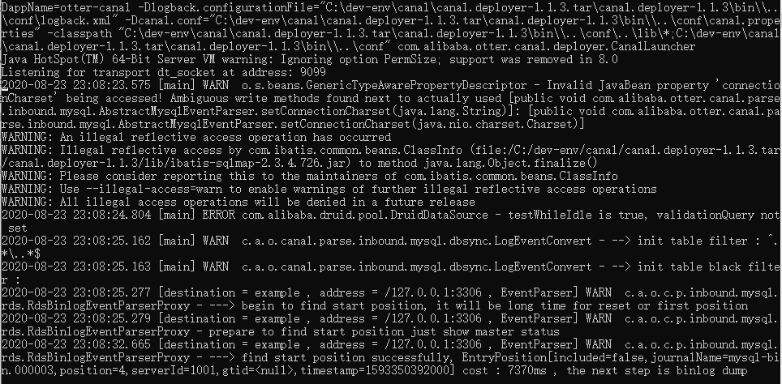
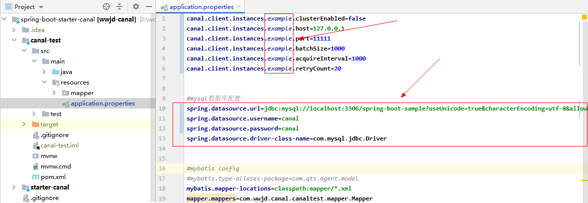

# SpringBoot整合canal

[toc]


源码地址：[spring-boot-starter-canal](../sample-canal/spring-boot-starter-canal)

## 推荐阅读

> - https://github.com/alibaba/canal
> - [阿里Canal框架数据库同步-实战教程](https://www.cnblogs.com/fuzongle/p/12741052.html)
> - 


## 一、基本概念

### 1.简介

**canal [kə'næl]**，译意为水道/管道/沟渠，主要用途是基于 MySQL 数据库增量日志解析，提供增量数据订阅和消费

> 早期阿里巴巴因为杭州和美国双机房部署，存在跨机房同步的业务需求，实现方式主要是基于业务 trigger 获取增量变更。从 2010 年开始，业务逐步尝试数据库日志解析获取增量变更进行同步，由此衍生出了大量的数据库增量订阅和消费业务。

基于日志增量订阅和消费的业务包括

- 数据库镜像
- 数据库实时备份
- 索引构建和实时维护(拆分异构索引、倒排索引等)
- 业务 cache 刷新
- 带业务逻辑的增量数据处理


### 2.工作原理

#### 2.1 MySQL主备复制原理


- MySQL master 将数据变更写入二进制日志( binary log, 其中记录叫做二进制日志事件binary log events，可以通过 show binlog events 进行查看)
- MySQL slave 将 master 的 binary log events 拷贝到它的中继日志(relay log)
- MySQL slave 重放 relay log 中事件，将数据变更反映它自己的数据

#### 2.2 canal 工作原理

- canal 模拟 MySQL slave 的交互协议，伪装自己为 MySQL slave ，向 MySQL master 发送dump 协议
- MySQL master 收到 dump 请求，开始推送 binary log 给 slave (即 canal )
- canal 解析 binary log 对象(原始为 byte 流)


## 二、安装Canal服务端

### 1.开启binlog

（1）需要先登录mysql 数据库，然后通过以下语句检查binlog功能是否开启：

```mysql
mysql> show variables like 'log_bin';
+---------------+-------+
| Variable_name | Value |
+---------------+-------+
| log_bin       | OFF   |
+---------------+-------+
1 row in set, 1 warning (0.00 sec)
```


（2）如果显示状态为OFF表示该功能未开启，则需要修改Mysql配置文件my.ini，增加如下配置：

```
[mysqld]
log-bin=mysql-bin # 开启 binlog
binlog-format=ROW # 选择 ROW 模式
server_id=1 # 配置 MySQL replaction 需要定义，不要和 canal 的 slaveId 重复
```


（3）然后重启数据库

（4）再次查看binlog功能是否有开启

```mysql
mysql> show variables like 'log_bin';
+---------------+-------+
| Variable_name | Value |
+---------------+-------+
| log_bin       | ON   |
+---------------+-------+
1 row in set, 1 warning (0.00 sec)
```


### 2.创建Mysql用户并授权

需要创建一个mysql用户，然后授予该用户作为 MySQL slave 的权限

```mysql
CREATE USER canal IDENTIFIED BY 'canal';  
GRANT SELECT, REPLICATION SLAVE, REPLICATION CLIENT ON *.* TO 'canal'@'%';
-- GRANT ALL PRIVILEGES ON *.* TO 'canal'@'%' ;
FLUSH PRIVILEGES;
```


### 3.下载 canal

（1）下载 canal, 访问 [release 页面](https://github.com/alibaba/canal/releases) , 选择需要的包下载，如：

```
 wget https://github.com/alibaba/canal/releases/download/canal-1.1.3/canal.deployer-1.1.3.tar.gz
```


（2）下载之后解压

（3）然后修改配置文件 `conf/example/instance.properties`

```properties
#################################################
## mysql serverId , v1.0.26+ will autoGen
# canal.instance.mysql.slaveId=0

# enable gtid use true/false
canal.instance.gtidon=false

# position info  需要改成自己的数据库信息
canal.instance.master.address=127.0.0.1:3306
canal.instance.master.journal.name=
canal.instance.master.position=
canal.instance.master.timestamp=
canal.instance.master.gtid=

# rds oss binlog
canal.instance.rds.accesskey=
canal.instance.rds.secretkey=
canal.instance.rds.instanceId=

# table meta tsdb info
canal.instance.tsdb.enable=true
#canal.instance.tsdb.url=jdbc:mysql://127.0.0.1:3306/canal_tsdb
#canal.instance.tsdb.dbUsername=canal
#canal.instance.tsdb.dbPassword=canal

#canal.instance.standby.address =
#canal.instance.standby.journal.name =
#canal.instance.standby.position =
#canal.instance.standby.timestamp =
#canal.instance.standby.gtid=

# username/password  需要改成自己的数据库信息
canal.instance.dbUsername=canal
canal.instance.dbPassword=canal
canal.instance.defaultDatabaseName=
canal.instance.connectionCharset = UTF-8
# enable druid Decrypt database password
canal.instance.enableDruid=false
#canal.instance.pwdPublicKey=MFwwDQYJKoZIhvcNAQEBBQADSwAwSAJBALK4BUxdDltRRE5/zXpVEVPUgunvscYFtEip3pmLlhrWpacX7y7GCMo2/JM6LeHmiiNdH1FWgGCpUfircSwlWKUCAwEAAQ==

# table regex
canal.instance.filter.regex=.*\\..*
# table black regex
canal.instance.filter.black.regex=
# table field filter(format: schema1.tableName1:field1/field2,schema2.tableName2:field1/field2)
#canal.instance.filter.field=test1.t_product:id/subject/keywords,test2.t_company:id/name/contact/ch
# table field black filter(format: schema1.tableName1:field1/field2,schema2.tableName2:field1/field2)
#canal.instance.filter.black.field=test1.t_product:subject/product_image,test2.t_company:id/name/contact/ch

# mq config
canal.mq.topic=example
# dynamic topic route by schema or table regex
#canal.mq.dynamicTopic=mytest1.user,mytest2\\..*,.*\\..*
canal.mq.partition=0
# hash partition config
#canal.mq.partitionsNum=3
#canal.mq.partitionHash=test.table:id^name,.*\\..*
#################################################

```


（4）然后运行 `bin/startup.bat`启动 canal 服务端，如下图所示启动成功：




## 三、SpringBoot 整合canal

### 1.下载测试代码

克隆如下仓库代码到本地：

> https://github.com/wanwujiedao/spring-boot-starter-canal

然后导入到Idea中


### 2.修改配置

修改`canal-test`工程下的 `application.properties`文件：

> - 将canal客户端实例修改为 example
> - 配置数据库的链接信息，随便配置一个本地的数据库




### 3.效果演示

（1）启动`CanalTestApplication`

（2）然后去数据库中删除一条数据，可在控制台看到如下日志：

```log
======================注解方式（删除数据操作）==========================
use spring-boot-sample;
DELETE FROM user WHERE id =35;

======================================================
======================接口方式（删除数据操作）==========================
use spring-boot-sample;
DELETE FROM user WHERE id =35;

======================================================
```


（3）然后去数据库中修改一条数据，可在控制台看到如下日志：

```log
======================注解方式（更新数据操作）==========================
use spring-boot-sample;
UPDATE user SET create_time='2020-08-23 23:32:06',update_time='',age='22',email='tomcat111@qq.com',password='password',username='tttomcat' WHERE id='34'

======================================================
======================接口方式（更新数据操作）==========================
use spring-boot-sample;
UPDATE user SET create_time='2020-08-23 23:32:06',update_time='',age='22',email='tomcat111@qq.com',password='password',username='tttomcat' WHERE id='34'

======================================================
```


